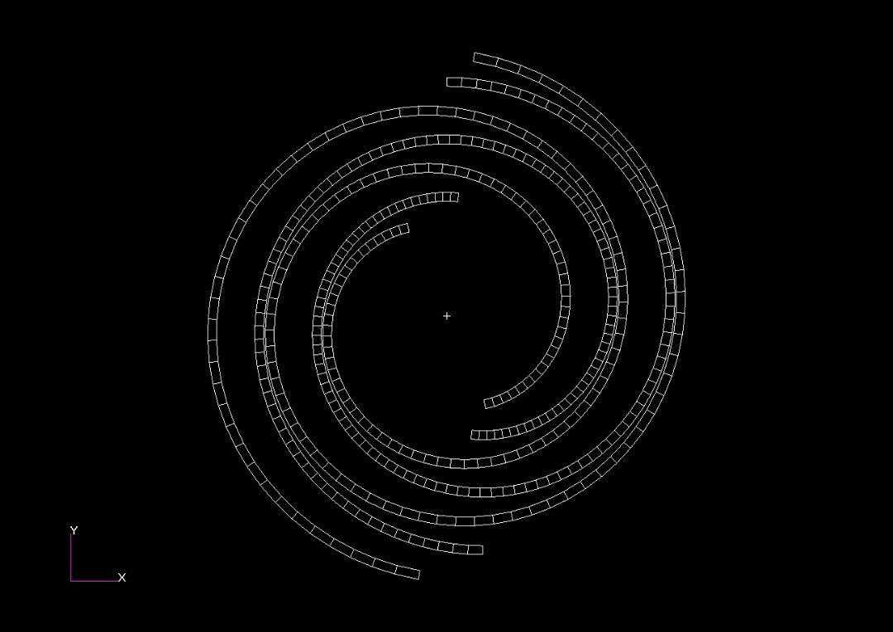
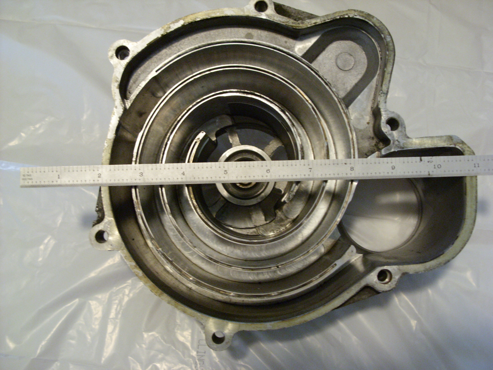
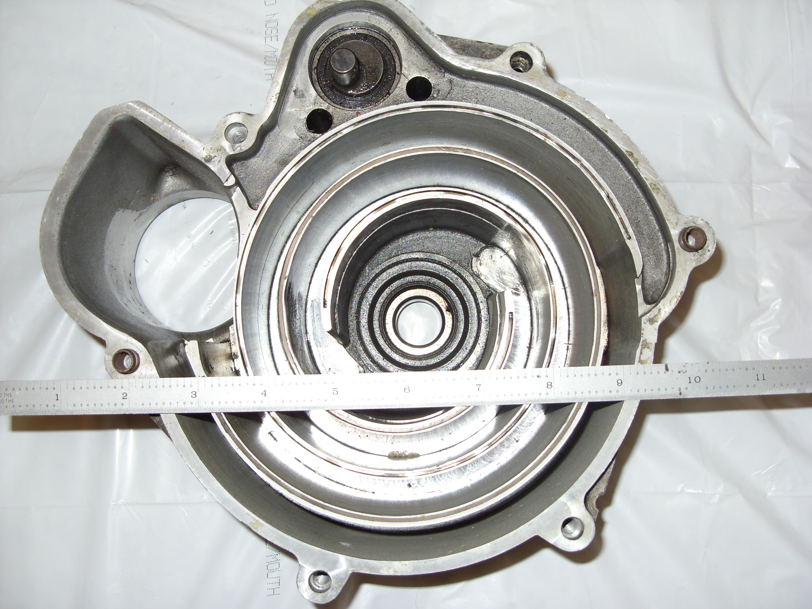
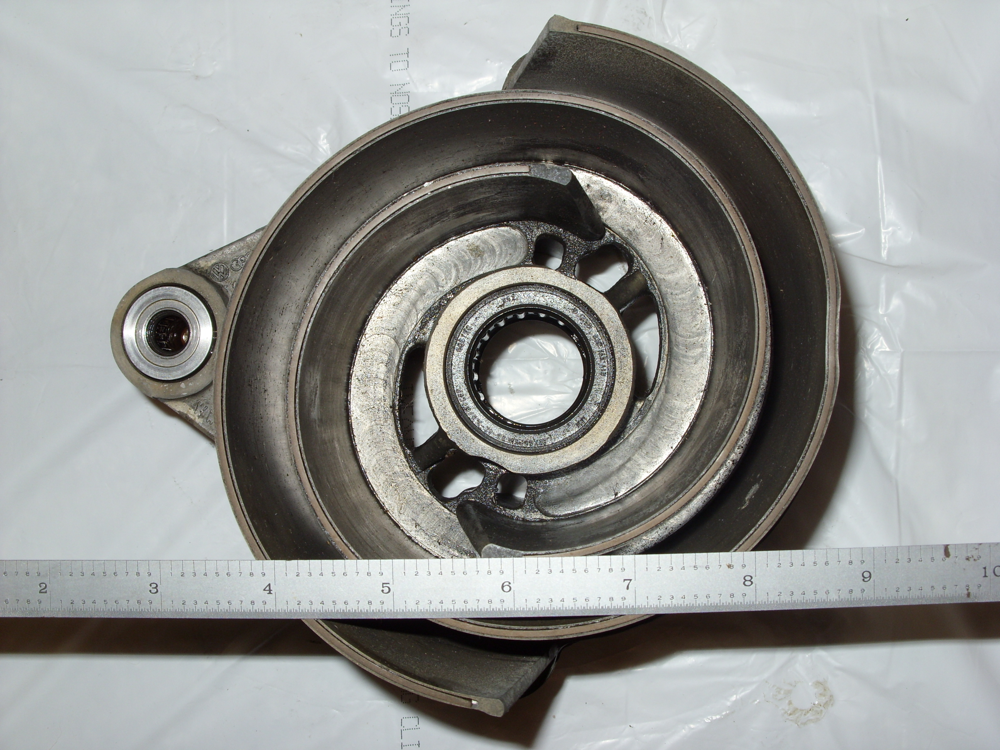
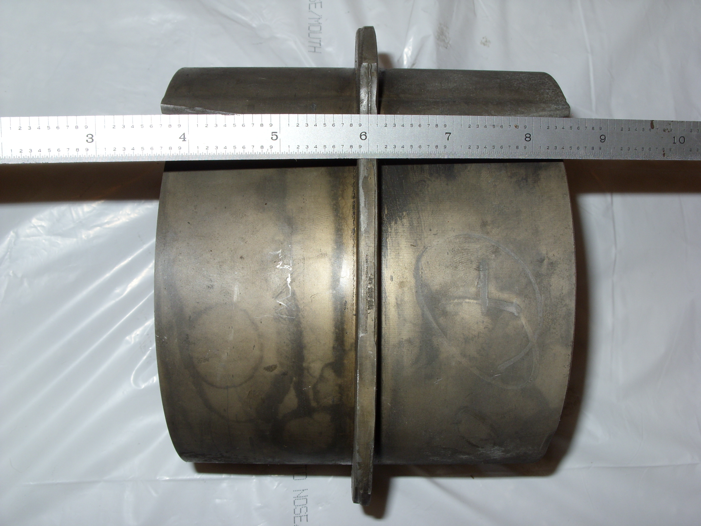
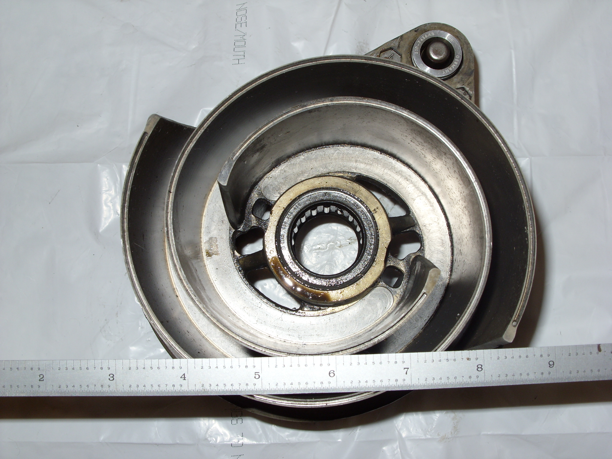

# ========================================
# Genetic Algorithm Optimization of Digitized Image Data of a Scroll Compressor/Supercharger/Expander:
# ========================================

## A Volkswagon "G-Ladder" Scroll Supercharger images are first digitized, and then optimized to minimize image digitization error using genetic algorithms.

##
## I. Input Images: 
## Ia. Image "SN850886":

## Ib. Image "SN850900":

## Ic. Image "SN850908":

## Id. Image "SN850910":

## Ie. Image "SN850912":

##
## II. Digitized Image Data: 
### IIa. Digitized Image "SN850886": "./digitized_image_data/SN850886_Fixed_Wrap.dat"
### IIb. Digitized Image "SN850900": "./digitized_image_data/SN850900_Fixed_Wrap.dat"
### IIc. Digitized Image "SN850908": "./digitized_image_data/SN850908_Orbit_Wrap.dat"
### IId. Digitized Image "SN850910": "./digitized_image_data/SN850910_Orbit_Wrap.dat"
### IIe. Digitized Image "SN850912": "./digitized_image_data/SN850912_Orbit_Wrap.dat"

##
## III. Output Files from Genetic Algorithm Optimization of Digitized Image "SN850886": 
### IIIa. Digitized Image "SN850886": "./genetic_algorithm_optimization/ga_SN850886_Fixed_Center_coords/ga.out"
### IIIb. Digitized Image "SN850886": "./genetic_algorithm_optimization/ga_SN850886_Fixed_Lower_Right_Inner_Involute_coords/ga.out"
### IIIc. Digitized Image "SN850886": "./genetic_algorithm_optimization/ga_SN850886_Fixed_Lower_Right_Outter_Involute_coords/ga.out"
### IIId. Digitized Image "SN850886": "./genetic_algorithm_optimization/ga_SN850886_Fixed_Upper_Left_Inner_Involute_coords_a/ga.out"
### IIIe. Digitized Image "SN850886": "./genetic_algorithm_optimization/ga_SN850886_Fixed_Upper_Left_Outter_Involute_coords/ga.out"

##
## IV. Output Files from Genetic Algorithm Optimization of Digitized Image "SN850900": 
### IVa. Digitized Image "SN850900": "./genetic_algorithm_optimization/ga_SN850900_Fixed_Center_coords/ga.out"
### IVb. Digitized Image "SN850900": "./genetic_algorithm_optimization/ga_SN850900_Fixed_Involute_coords/ga.out"
### IVc. Digitized Image "SN850900": "./genetic_algorithm_optimization/ga_SN850900_Fixed_Left_Inner_Involute_coords/ga.out"
### IVd. Digitized Image "SN850900": "./genetic_algorithm_optimization/ga_SN850900_Fixed_Left_Outter_Involute_coords/ga.out"
### IVe. Digitized Image "SN850900": "./genetic_algorithm_optimization/ga_SN850900_Fixed_Right_Inner_Involute_coords/ga.out"
### IVf. Digitized Image "SN850900": "./genetic_algorithm_optimization/ga_SN850900_Fixed_Right_Outter_Involute_coords/ga.out"

##
## V. Output Files from Genetic Algorithm Optimization of Digitized Image "SN850908": 
### Va. Digitized Image "SN850908": "./genetic_algorithm_optimization/ga_SN850908_Orbit_Bottom_Inner_Involute_coords/ga.out"
### Vb. Digitized Image "SN850908": "./genetic_algorithm_optimization/ga_SN850908_Orbit_Bottom_Outter_Involute_coords/ga.out"
### Vc. Digitized Image "SN850908": "./genetic_algorithm_optimization/ga_SN850908_Orbit_Center_coords/ga.out"
### Vd. Digitized Image "SN850908": "./genetic_algorithm_optimization/ga_SN850908_Orbit_Top_Inner_Involute_coords/ga.out"
### Ve. Digitized Image "SN850908": "./genetic_algorithm_optimization/ga_SN850908_Orbit_Top_Outter_Involute_coords/ga.out"

##
## VI. Output Files from Genetic Algorithm Optimization of Digitized Image "SN850910": 
### VIa. Digitized Image "SN850910": "./genetic_algorithm_optimization/ga_SN850910_Orbit_Bearing_Center_coords_a/ga.out"
### VIb. Digitized Image "SN850910": "./genetic_algorithm_optimization/ga_SN850910_Orbit_Crank_Center_coords/ga.out"

##
## VII. Output Files from Genetic Algorithm Optimization of Digitized Image "SN850912": 
### VIIa. Digitized Image "SN850912": "./genetic_algorithm_optimization/ga_SN850912_Orbit_Center_coords/ga.out"
### VIIb. Digitized Image "SN850912": "./genetic_algorithm_optimization/ga_SN850912_Orbit_Crank_Center_coords/ga.out"
### VIIc. Digitized Image "SN850912": "./genetic_algorithm_optimization/ga_SN850912_Orbit_Involute_coords/ga.out"
### VIId. Digitized Image "SN850912": "./genetic_algorithm_optimization/ga_SN850912_Orbit_Left_Inner_Involute_coords_a/ga.out"
### VIIe. Digitized Image "SN850912": "./genetic_algorithm_optimization/ga_SN850912_Orbit_Left_Outter_Involute_coords_a/ga.out"
### VIIf. Digitized Image "SN850912": "./genetic_algorithm_optimization/ga_SN850912_Orbit_Right_Inner_Involute_coords_a/ga.out"
### VIIg. Digitized Image "SN850912": "./genetic_algorithm_optimization/ga_SN850912_Orbit_Right_Outter_Involute_coords_a/ga.out"

